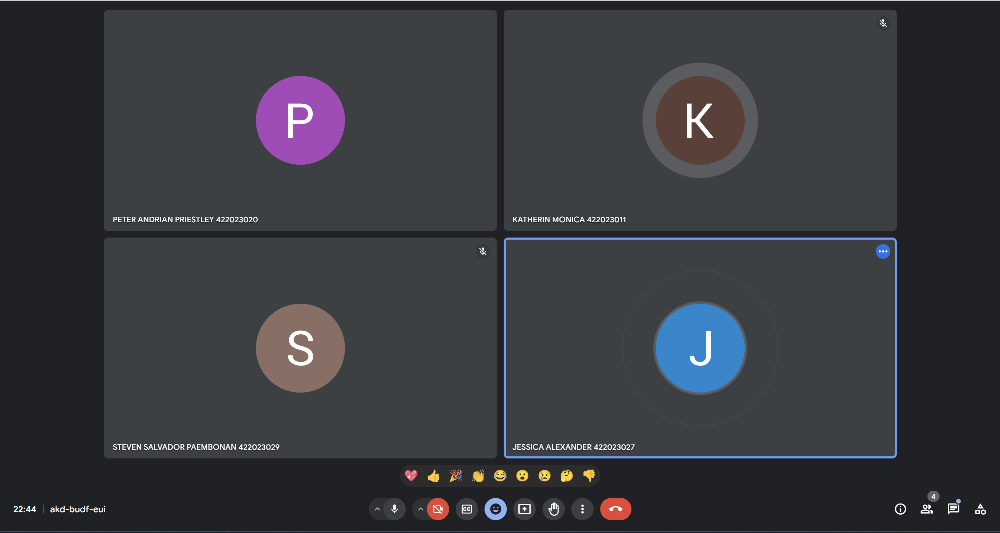

# Members:
- Jessica Alexander - 422023027
- Katherin Monica - 422023011
- Peter Andrian Priestley - 422023020
- Steven Salvador Paembonan - 422023029

# Group Work Documentation:


### Quick start

- To start and build the development flask backend:
*note: every changes that is made, this command should be re-run
```
docker compose -f docker-compose.yaml up --build -d
```
Note: `docker compose` command is used in `Compose V2`. Supoosedly your version is `Compose V1` replace `docker compose` with `docker-compose`

After successful run the dev server, you will be able to see all containers are running 
```shell
docker ps
```
check specific container
```shell
docker ps --filter name="name of the container" 
```
- To stop service
```
docker compose -f docker-compose.yaml down
```
*specify `-v` to remove the mongodb volume*

- To remove all container
```
docker system prune
```

### Tech stack
- Flask
- MongoDB
- Docker  

References
* flask_mongoengine -> MongoDB connector ([docs](https://docs.mongoengine.org/# "docs"))
  * flask_jwt_extended -> JWT Token
- MongoDB ([docs](https://github.com/docker-library/docs/tree/master/mongo "docs"))

- Marshmallow -> Schema Validator ([docs](https://marshmallow.readthedocs.io/en/stable/index.html "docs"))
- Docker


### Debugging

1. rebuild your development with:
```
docker compose -f docker-compose.yaml up --build -d
```
2. check your container name using:
```shell
docker ps
```
3. Try and debug your error from docker logs:
```shell
docker logs 'container name'
```

# Requirement Analysis of UKRIDA PORTAL SYSTEM
## Functionality
- **Capability**: The system should support different user roles (students, professors, librarians and admin) with role-specific functionalities. For students, this will include viewing grades, class schedule, exam schedule, attendance, billings, courses and course materials as well as other neccesity namely joining courses and submiting certificates. Professors would need to teach course, post grades, attendance, exam schedule and course materials. Librarians would need to be able to add books to the E-library and, record borrow and return of physical books. Admins would register the professor's, librarian's, and student's accounts, create and assign the professors to a class, input billings, update student's semester, add courses to KRS packages, post announcement in the portal, view tickets, and clear backlogs.
- **Reusability**: Components like user authentication, data retrieval, and notification services should be designed for reuse across different modules.
- **Security**: User authentication, data encryption, and access control are essential. Sensitive data like student records and grades must be securely managed.
- **Integration**: The system should integrate with existing institutional databases or systems for seamless data exchange.
- **Collaboration Tools**: Integration with collaboration tools like chat or forums for student-teacher interaction outside of class hours.
## Usability
- **Human Factors**: The interface should be intuitive for all user types, accommodating varied tech proficiency. It should have a responsive design for different devices.
- **Consistency**: The system should maintain a consistent look and feel across all modules and user roles.
- **Documentation**: Comprehensive user guides for each user role, FAQs, and system manuals are necessary.
- **Personalization**: Allow users to customize their dashboard or settings based on their preferences.
- **Feedback Mechanism**: Implement a feedback mechanism for users to provide suggestions or report issues.
- **Provide Guidelines**: Offer tutorials or video guidelines for users to familiarize themselves with the system.
## Reliability
- **Availability**: The system should be available 24/7, with minimal downtime.
- **Failure Rate & Duration**: It should have a low failure rate. Any system failures should be resolved quickly.
- **Predictability**: System behavior in response to user actions should be predictable and consistent.
- **Backup & Recovery**: It needs to have a activity log that record each action, making sure that it is recoverable later on.- 
- **Back up server**: Have a back up server or failover mechanisms to ensure continuous availability.
## Performance
- **Speed**: Fast response times for user queries and actions.
- **Efficiency**: Optimized for minimal resource consumption without compromising functionality.
- **Resource** Consumption: Should be optimized to work smoothly on standard institutional hardware.
- **Scalability**: Capable of handling an increasing number of users and data volume.
- **Caching Mechanism**: Make a caching mechanisms to improve response times for frequently accessed data.
- **Load Balancing**: Distribute incoming traffic across multiple servers to prevent overloading and ensure consistent performance.
- **Optimized Database Queries**: Optimize database queries to improve overall system performance.
## Supportability
- **Testability**: The system should be easily testable to find and fix bugs.
- **Extensibility**: It should be designed to allow easy updates and additions of new features.
- **Serviceability**: Problems within the system should be easy to diagnose and fix.
- **Configurability**: Allow easy configuration of features like user roles, permissions, and system settings.
- **User Support Channels**: Provide multiple channels for user support, such as email, live chat, or phone support.
# Components
**User (Abstracts Class)**  
Attributes: id, name, email, password, is_logged_in  
Method: login(), logout(), is_logged_in(), get_user_id(), get_name(), report_issue(), view_announcement(), search_books(), view_book_content()  
  
**Admin (Inherits User)**  
Attributes: -  
Method: create_user_account(), create_course(), assign_professor(), input_billing(), update_semester(), add_course_krs(), post_announcement(), view_tickets(), clear_backlog()  
  
**Professor (Inherits User)**  
Attributes: courses_taught(List)  
Method: teach_course(), post_grade(), post_attendance(), post_exam_schedule(), post_course_material()  
  
**Student (Inherits User)**  
Attributes: course_list(List), grade_list(Dict), billing_amount, semester, krs, soft_point, certificate  
Method: join_course(), view_grades(), view_attendance(), view_courses(), view_exam_schedule(), view_course_materials(), view_billing, submit_certificate()  
  
**Librarian (Inherits User)**  
Attributes: file_path //for db  
Method: add_books(), borrow_book(), return_book()  
  
**Course**  
Attributes: course_id, course_name, instructor, description, schedule, students_joined(List), course_materials(List), course_grades(Dict), course_attendance(Dict), exam_schedule(Dict)  
Method: add_student(), set_grade(), set_attendance(), set_exam_schedule(), set_course_material(), get_student_list(), \_\_str\_\_()  
  
**Book**  
Attributes: title, author, genre, content  
Method: \_\_str\_\_()  

**ETicketSystem**  
Attributes: tickets(List)  
Method: create_ticket(), view_tickets()  

**Library**  
Attributes: _name, books(List)  
Method: get_book_results(), get_book_content()  

**AnnouncementSystem**  
Attributes: announcement_list(List)  
Method: create_announcement(), view_announcement()

# Use Case and User Stories
## Entity/Actor
- Student
- Professor
- Admin
- Librarian
## User Story
Allows the user which are students, professors, librarians, and admins to be able to interact and use this platform to check thier activities and use this system as a working environment.  Students should be able to join courses, viewing grades, class schedule, exam schedule, attendance, billings, courses and course materials, and submit certificates. Professors should be able to teach course, post grades, attendance, exam schedule and course materials. Librarians should be able to add books to the E-library and, record borrow and return of physical books. Admins should be able to register the professor's, librarian's, and student's accounts, create and assign the professors to a class, input billings, update student's semester, add courses to KRS packages, post announcement in the portal, view tickets, and clear backlogs.
### Use Case Portal

### Use Case Sisfo

### Use Case UVC

### Use Case E-Library

### Use Case E-Ticket

## Class Diagram

